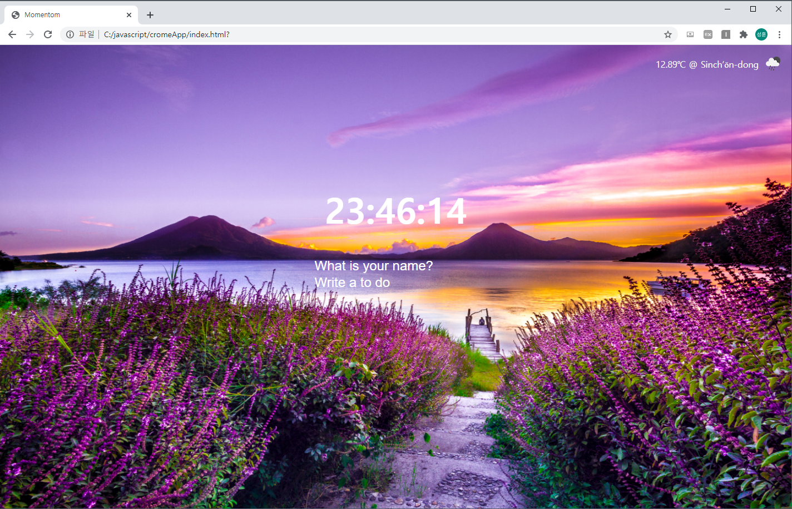
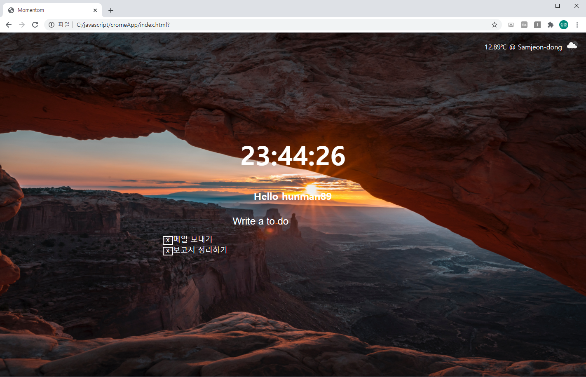

## 크롬앱 클론코딩

> 시간, 날씨를 나타내고, 사용자 이름과 할일을 local-storage에 저장해주는 간단한 todolist app

#### 기술

JacaScript, HTML, CSS

openwheather API

#### 구현 내용

- 초기 화면 (우측 상단에 기온, 위치, 날씨 아이콘)

- 이름과 할일을 입력했을 때 화면

* 버튼을 누르면 삭제
